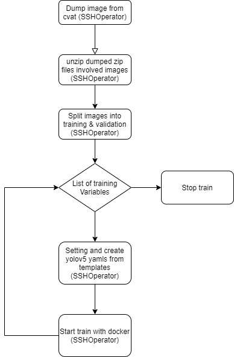
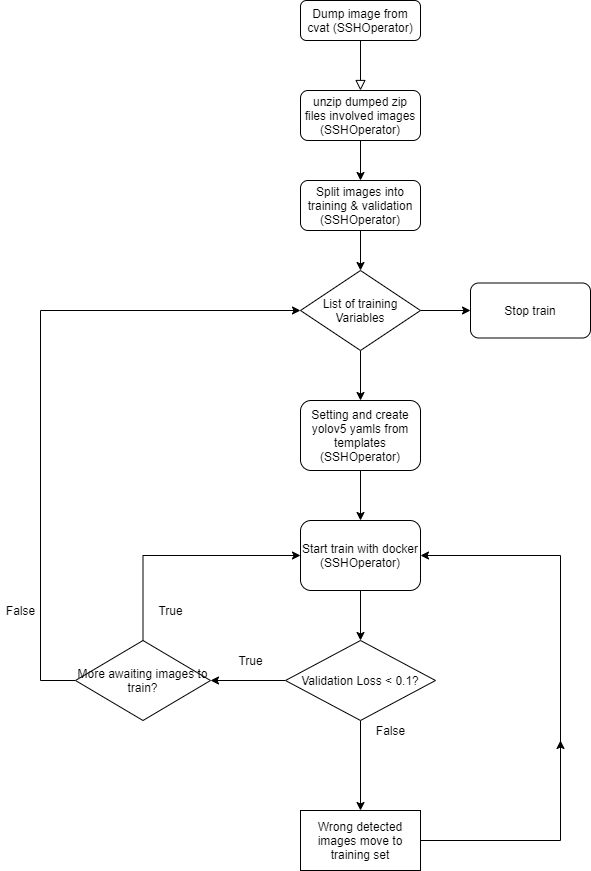
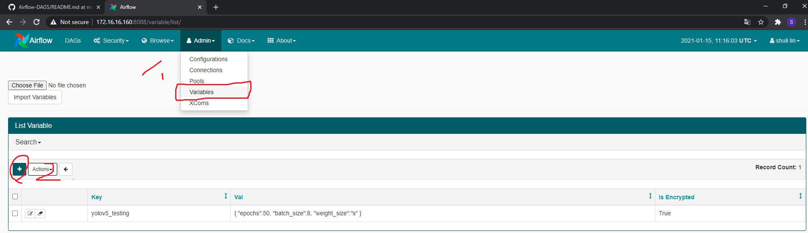
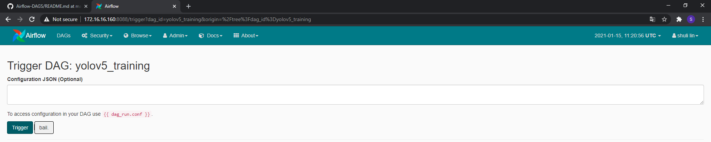

# How to use yolov5_training dag?

## work-flow diagram:
### Method 1.


### Method 2.



### Add Variables in the following place illustrated above
1. Create a variable(namely ```variable_names```)  which include all the config names of list

```yaml
{
  "names": ["<variable_name1>", "<variable_name2>"]
}
```
---
2. Create other two variable on the list in step 1. (```all environment variables are below```)
```json
{
  "weight_size": "s",
  ......
  ....
}
```


### Once you trigger the task fill in a json format as follows:
### Warning !: REMEMBER, PLEASE USE DOUBLE QUOTE !
```json
{
    "cvat_dump_keyword": "<your key word to dump image from cvat>"
}
```

# Environments Variables ({{ dag_run.conf }}.)

- cvat_dump_keyword: The keyword of dumped variable from cvat

# Environments Variables ({{ var.json.<your_key>}}.)
## For train.py
- weight_size (s, m, x, l)
- epochs
- batch_size
---
## For hyp.scratch.yaml
- lr0
- lrf
- momentum
- weight_decay
- warmup_epochs
- warmup_momentum
- warmup_bias_lr
- box
- cls
- cls_pw
- obj
- obj_pw
- iou_t
- anchor_t
- fl_gamma
- hsv_h
- hsv_s
- hsv_v
- degrees
- translate
- scale
- shear
- perspective
- flipud
- fliplr
- mosaic
- mixup
